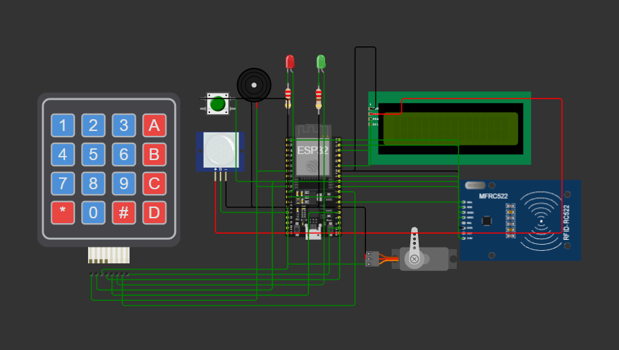
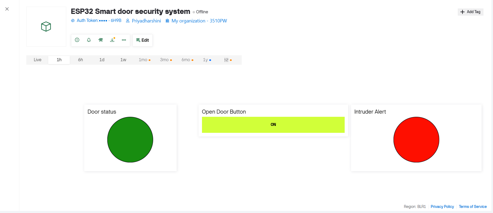

# 🔐 IoT-Smart-Door-Security-System

An IoT-based smart door security system developed using **ESP32**, **RFID**, **Keypad**, **PIR Sensor**, **Servo Motor**, and **Blynk IoT**. The system provides intelligent multi-level authentication, real-time notifications, visitor monitoring, and automated door control for enhanced home security.

---

## 📌 Table of Contents

- Overview
- Features
- Hardware Components
- Software & Technologies
- System Architecture
- Working Principle
- Authentication Methods
- Project Structure
- Getting Started
- Screenshots
- Advantages
- Applications
- Limitations
- Future Enhancements
- License
- Author

---

# 📖 Overview

The **Smart Door Security System** is an IoT-enabled embedded system designed to improve home and office security through intelligent access control. Unlike conventional security systems that generate notifications for every event, this project sends alerts only when required, reducing unnecessary notifications while maintaining effective security.

The system integrates RFID authentication, password verification, PIR-based visitor detection, a smart doorbell, servo-controlled locking, LCD status display, and cloud-based notifications using the Blynk IoT platform.

---

# ✨ Features

- 🔐 RFID Card Authentication
- 🔢 Password Authentication using 4×4 Keypad
- 🚶 PIR Motion Detection
- 🔔 Smart Doorbell Integration
- 📱 Blynk IoT Mobile Control
- 📢 Intelligent Visitor Notification
- 🚨 Intruder Detection Alerts
- 🔒 Automatic Servo Door Lock
- 📟 LCD Status Display
- 🔊 Buzzer Security Alarm
- 💡 LED Status Indicators
- 🌐 ESP32 Wi-Fi Connectivity

---

# 🛠 Hardware Components

| Component | Quantity |
|------------|---------:|
| ESP32 Development Board | 1 |
| RFID RC522 Module | 1 |
| 4×4 Matrix Keypad | 1 |
| PIR Motion Sensor | 1 |
| Servo Motor | 1 |
| 16×2 I2C LCD | 1 |
| Push Button (Doorbell) | 1 |
| Buzzer | 1 |
| LEDs | 2 |
| Breadboard | 1 |
| Jumper Wires | As Required |

---

# 💻 Software & Technologies

- Arduino IDE
- ESP32
- Embedded C++
- Blynk IoT
- Wokwi Simulator
- Git & GitHub

---

# 🏗️ System Architecture

<p align="center">

</p>

---

# ⚙️ Working Principle

1. The PIR sensor detects visitor movement near the door.
2. The LCD displays the visitor status.
3. The visitor can ring the doorbell or authenticate using RFID or a password.
4. The ESP32 verifies the RFID card or password.
5. If authentication succeeds, the servo motor unlocks the door.
6. If authentication fails multiple times, an intruder alert is triggered.
7. If no interaction occurs within one minute, a notification is sent to the homeowner through Blynk.
8. The system automatically locks the door after access.

---

# 🔐 Authentication Methods

### 🪪 RFID Authentication
Only authorized RFID cards are allowed to unlock the door.

### 🔢 Password Authentication
Users can enter the correct password using the keypad.

### 🚨 Intruder Detection
Three consecutive incorrect authentication attempts trigger:
- Buzzer alarm
- LED warning
- Blynk notification

---

# 📂 Project Structure

```
IoT Smart Door Security System/
│
├── code/
│     Smart_Door_Security_System.ino
│
├── images/
│     circuit_diagram.png
│     blynk_dashboard.png
│
├── wokwi/
│     diagram.json
│     wokwi_link.txt
│
├── README.md
```

---

# 🚀 Getting Started

## Clone the Repository

```bash
git clone https://github.com/priyadharshinit2025ece-boop/Smart-Door-Security-System-ESP32.git
```

## Requirements

- Arduino IDE
- ESP32 Board Package
- Blynk Library
- MFRC522 Library
- Servo Library
- Keypad Library
- LiquidCrystal I2C Library

## Steps

1. Clone the repository.
2. Open the Arduino project.
3. Install the required libraries.
4. Replace the placeholders:

```cpp
#define BLYNK_AUTH_TOKEN "YOUR_BLYNK_AUTH_TOKEN"

char ssid[] = "YOUR_WIFI_NAME";
char pass[] = "YOUR_WIFI_PASSWORD";
```

5. Upload the program to ESP32 or simulate it using Wokwi.

---

# 📷 Screenshots

## 🔌 Circuit Diagram

<p align="center">

</p>

---

## 📱 Blynk Dashboard

<p align="center">

</p>

---

# ✅ Advantages

- Multiple authentication methods
- Low-cost implementation
- Real-time IoT monitoring
- Reduced unnecessary notifications
- Easy to expand with new features
- Suitable for smart home applications

---

# 🏠 Applications

- Smart Homes
- Apartments
- Offices
- Laboratories
- Hostels
- Residential Security
- Small Businesses

---

# ⚠️ Limitations

- Prototype tested in Wokwi simulation
- Requires Wi-Fi connectivity
- No biometric authentication
- No battery backup
- Does not maintain access history

---

# 🚀 Future Enhancements

- ESP32-CAM Face Recognition
- Fingerprint Authentication
- Cloud Database
- Flutter Mobile Application
- AI-Based Visitor Recognition
- Voice Assistant Integration
- Battery Backup
- Door Position Sensor
- OTP-Based Visitor Authentication

---


# 👩‍💻 Author

**Priyadharshini T**

🎓 B.E. Electronics and Communication Engineering  
🏫 Rajalakshmi Engineering College

- GitHub: https://github.com/priyadharshinit2025ece-boop
- LinkedIn: https://www.linkedin.com/in/priyadharshini-tamilselvan-707497383/

---

⭐ If you found this project useful, consider giving it a star!
